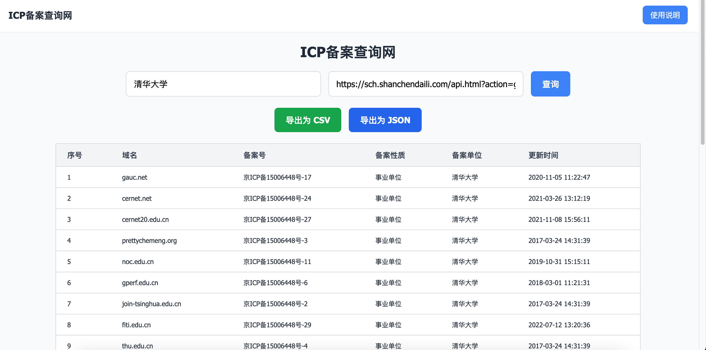
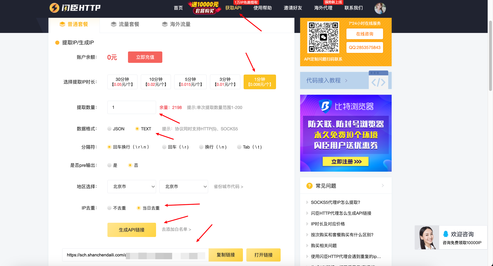
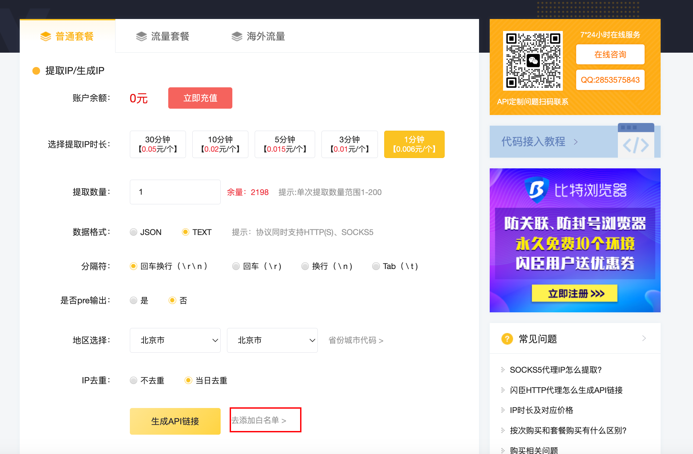
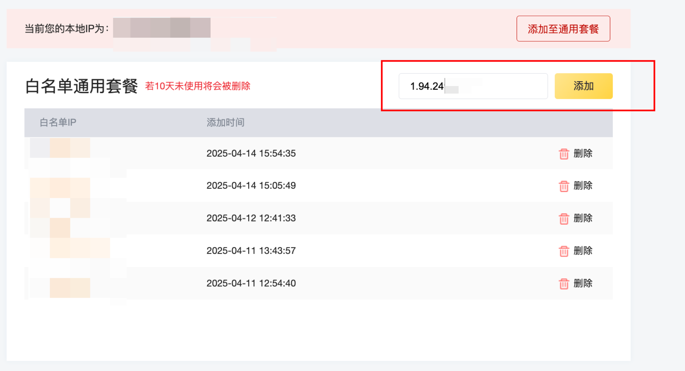
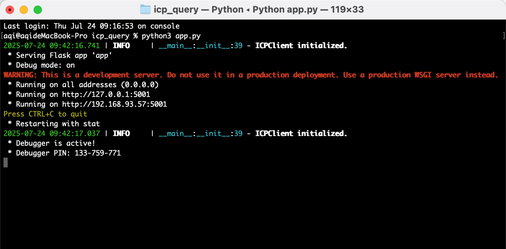
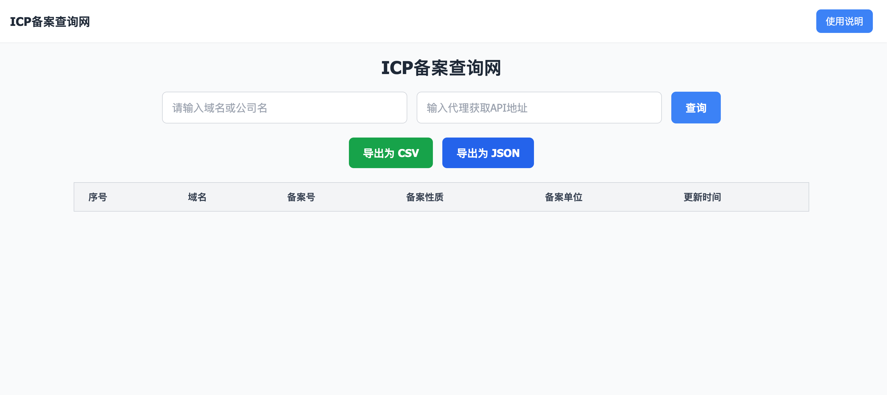
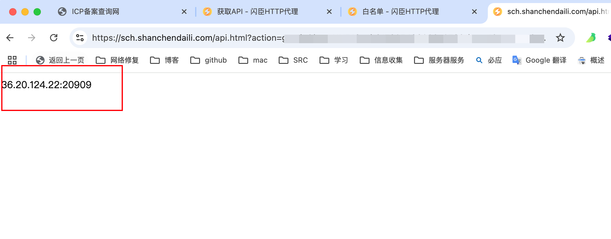

## ICP备案实时查询

### 本地使用说明

项目地址：[https://github.com/076w/icp_query](https://github.com/076w/icp_query)

使用说明：[https://www.yuque.com/076w/tools/exg8oa62s2ggp7s6](https://www.yuque.com/076w/tools/exg8oa62s2ggp7s6)

#### 代理API：

因为对接的 gov 官网，使用代理来规避频繁风险，我这里使用的是闪臣HTTP代理

[https://h.shanchendaili.com/invite_reg.html?invite=5t6Brm](https://h.shanchendaili.com/invite_reg.html?invite=5t6Brm)

复制链接到浏览器注册登录实名后送3000代理ip

点击 获取API--选择IP时长1分钟--提取数量为1--数据格式TEXT--IP去重--生成API

复制生成的链接会自动将本地 IP 加入白名单

如果对白名单 IP 有更改需求可以点击 去添加白名单

将自己的 IP 添加进去即可正常使用

#### 脚本启动：

进入 icp_query 文件夹

python3 app.py

访问 [http://127.0.0.1:5001](http://127.0.0.1:5001) 即可

输入域名或公司名后，输入代理API地址点击查询即可

#### 查询示例

查询接口请自行抓包[http://127.0.0.1:5001](http://127.0.0.1:5001)

如果一直报错请自行访问代理接口查看是否正常回显ip:端口

如正常回显则再次刷新本地 http://127.0.0.1:5001 尝试查询即可

